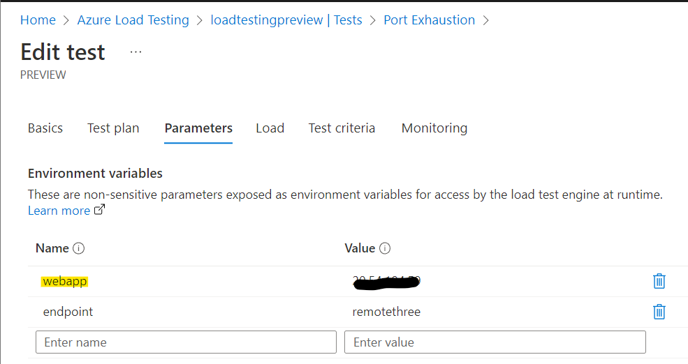

# SNAT port exhaustion in AKS - how to diagnose and mitigate

## Background

Network Address Translation (NAT) is used widely across the internet and is commonly used as a means of allowing a large number of devices on a private network to make requests to the internet using a common outbound IP address. Your home network performs NAT so that any requests from one of your devices in your home network can be made to the internet and the responses routed back the correct device. In the case of a home network, the router provides the NAT capability so that to the outside world all devices in your home network appear as a single outbound IP address. See this Wikipedia article here https://en.wikipedia.org/wiki/Network_address_translation

When NAT is used with networking, there has to be a means of mapping outbound and inbound ports. The service performing NAT has to keep hold of the return address of the network endpoint behind the NAT gateway. At an infrastructure level TCP IPv4 only has 64k ports, which seems plenty, but shared platform services often have to share this across 64k ports across a number of workloads.

In the case of Azure Kubernetes Service (AKS), NAT is slightly different depending on whether the AKS cluster is configured for kubnet or Azure CNI. See here https://learn.microsoft.com/en-us/azure/aks/concepts-network. But for workloads inside AKS that need to access resources outside of the virtual network environment (VNet), NAT is always used and is essentially managed by an Azure load balancer that is provisioned when the AKS cluster gets created.

This load balancer by default only hands out 1000 TCP ports per node pool VM instance. This 1000 also gets multiplied by the number of public IP addresses attached to the load balancer.

Any applications deployed to an AKS cluster therefore will have a limited set NAT ports when calling services outside its VNet. How the application code is written and how quickly any dependent calls outside of the cluster respond, will have a major impact on the usage of these NAT ports.

When there are no NAT ports left to service outbound connections, errors will occur as connections will no longer be made correctly. This is what is referred to as "NAT port exhaustion".

## Diagnosing

Applications that suffer from NAT port exhaustion will initially see connect times to remote resources increase. There may not be be errors, but response times from remote connections will increase and the overall throughput of the API will go down.

As ports are handed out by the load balancer that gets created when the AKS cluster is created, this is where to look for problems.


## Sample Application


In order to demonstrate how NAT port exhaustion can occur, several things are needed:
1. An application (web API) hosted in AKS that makes HTTP requests to a remote service - preferably outside the AKS VNet. It is also useful to be able to vary the target and to re-use or not HTTP connections to see how this impacts its behaviour. In this repository, this is referred to as the "source"
2. A target application (web API) outside of AKS and preferably outside of the VNet that accepts requests from the source and returns responses. Some means of varying the response time from this service is also useful. In this repository, this is referred to as the "target".
3. A means of driving load into the source in a reliable manner. A JMeter load test is used and driven by Azure load test https://learn.microsoft.com/en-gb/azure/load-testing/overview-what-is-azure-load-testing
4. Monitoring AKS and the API in AKS.

This repository has code for both the source and target REST APIs that may be used to test. The "source" application is a C# .NET Core web API and comes with a Dockerfile and deployment yaml for the AKS cluster.

The target application is designed to run under an Azure App Service, so its a question of building this and deploying to an App Service. 

### Configuration
1. The source web app needs to have the target URL. It is best to therefore create an App Service in Azure and then use its FQDN for the configuration of the source. The deployment YAML for the source application is shown below:

```
apiVersion: apps/v1
kind: Deployment
metadata:
  name: request-send
spec:
  replicas: 1
  selector:
    matchLabels:
      app: request-send
  template:
    metadata:
      labels:
        app: request-send
    spec:
      nodeSelector:
        "kubernetes.io/os": linux
      containers:
      - name: request-send
        image: jjnews.azurecr.io/requestsend:300
        resources:
          requests:
            cpu: 1000m
            memory: 1024Mi
          limits:
            cpu: 1500m
            memory: 2048Mi
        ports:
        - containerPort: 8080
        env:
        - name: three
          value: "https://mytargeturl.azurewebsites.net/weatherforecast"
        - name: onenew
          value: "true"
        - name: twonew
          value: "true"
        - name: threenew
          value: "true"
---
apiVersion: v1
kind: Service
metadata:
  name: request-send
spec:
  type: LoadBalancer
  ports:
  - port: 80
  selector:
    app: request-send
```
As can be seen above, the environment variable "three" needs to be set to your App Service URL.

2. The load test needs to have the public IP address of the service in AKS that represents the source application. This is set in the load test by setting the value of the "webapp" parameter.




 Async
7. Reuse of connections
8. The amount of data outbound from the AKS-hosted app to the dependency and how much data is returned from the dependency
9. Generally how long a dependent call takes (as it is keeping the underlying TCP connection open)

What can go wrong

## How to test

## How to monitor and diagnose

## How to mitigate/remediate


# Conclusions
